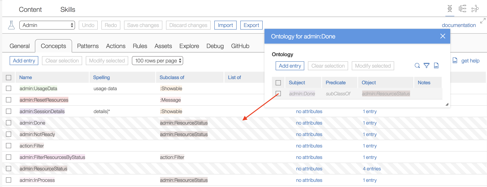

## Fine grained component activation and deactivation

We are glad to announce a new control to EBA dev lab--fine grained component activation and deactivation. Following our last release which allowed developers to deactivate entire agents, developers can now deactivate particular components within an agent. We found that this feature is integral to active development and experimentation within EBA. Concepts, actions, assets, endpoints, etc. can now all be controlled in a more developer friendly way when debugging certain reasoning and execution flows within EBA. The example below shows a case where are all actions producing data for `weather:Forecast` are deactivated.

As concepts form the basis for more complex components such as action and rules, we have ensured that deactivation of a given concept is propagated to other related components. In other words, disabling a concept will also disable any actions or rules which make use of this particular concept. 

As ontology is an interconnected set of relationships, we have also introduced the notion of _partially active_ concepts. These are concepts which contain a predicate which is deactivated. Partially active concepts are simply meant to signify that the concepts themselves are still active, but some underlying relationship is deactivated. The example below shows a case where the predicate `weather:Alerts isListOf weather:Alert` is deactivated. 

### Some use cases to consider

_Note: this is a general troubleshooting feature, but we provide some use cases to shed more light on how it can be leveraged._

If a developer is implementing some action, and, in course of development, realized that the action should be decomposed into smaller actions, he would have previously had to manually delete the signature and back up relevant code block--quite tedious. Now you can simply deactivate the action and even refer to it in the course of your refactor.

Another example is with endpoints. If a developer wanted to test execution with and without a certain endpoint in the pipeline, we found that some developers would provide an invalid name as a way of "commenting" out this endpoint, e.g. rename `@start` to `@start2` or `@annotate` to `@annotate-old`. Deactivation provides a standard way of doing this across _all_ components. 

This can also be useful in the case of more fundamental changes to your agent--when intending to the refactor the ontology in a less destructive way. This feature allows you to easily comment out a concept (and all associated actions and rules) when providing your new implementation. You can maintain both side by side during experimentation phase.
