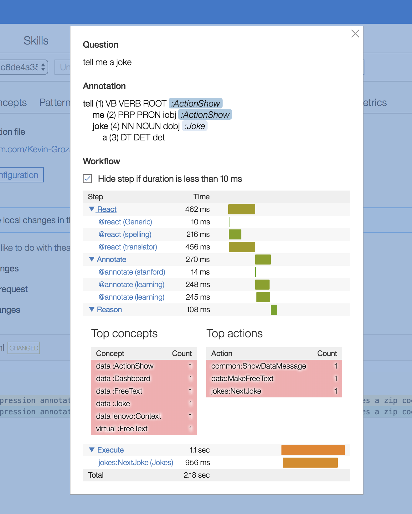

## Execution Workflow

As an new AI technology, EBA strives to abide by certain principles of transparency. We want EBA to be an open box; and we quite adamantly and intentionally provide introspection tools across our application. Along these lines, EBA has a released a new UI feature detailing the execution workflow of a particular question. This execution workflow provides a sequential timeline of our execution pipeline. At each step in the pipeline, you are able to find relevant information such as the actions invoked and their respective timings. If you are ever curious about the timing metrics of a particular question, or, if there is a particular bottle-neck for a given question, you should now be able to easily identify it.

As you can see from the diagram below, the main categories we track in our execution pipeline are endpoints such as react and annotation, in addition to reasoning and execution. Additional categories are detailed in the case of integrations with external channels such as Slack or SCI Resolution Rooms.

### Some use cases to consider

The traditional use case is in the event that a particular question takes a substantial amount of time to respond. By examining our execution pipeline, you will immediately be able to identify the bottleneck. For instance, whether it is caused by the annotation process or by some peculiar action.

Another common use case occurs in the case that there is some additional overhead associated with your agent at reasoning time. We now provide a summary of the total number of concepts and actions considered by our system during reasoning. This serves to help developers identify any actions or rules which can cause performance concerns.
