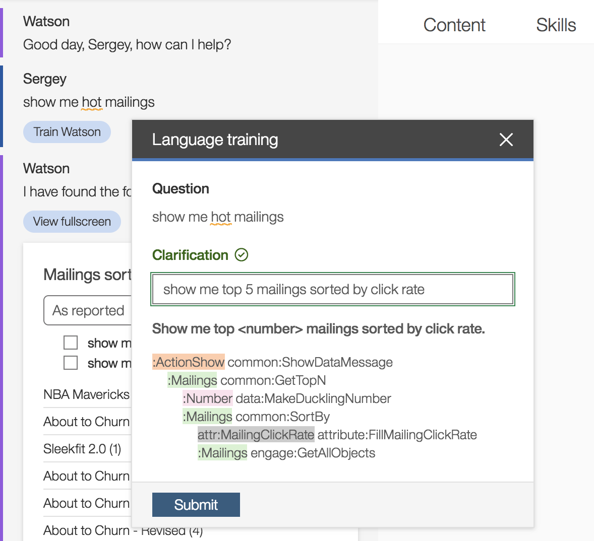

## NL based clarification learning

It is now possible to train EBA to understand new words or phrases by simply explaining the meaning using natural language only. Given the correct explanation EBA will create all the necessary  natural language patterns, concepts and semantic actions automatically. This mode is learning is useful to business practitioners, who may not understand to the technical aspects of their assistant, but would like to clarify their intentions using an interface familiar to everyone--natural language. Below is an example of this learning in action.

EBA is transparent about the parts of your question which it does not understand, as it is denoted by a colored underlining. In the example above, the term 'hot' was not understand. By clicking the 'Train Watson' icon beneath your question, you can explain to EBA what exactly you meant by this term. Here 'hot' denotes top 5 mailings sorted by click rate. By simply rephrasing your statement in a more precise way, Watson is able to recognize and reuse new terms going forward. This custom training will follow you as a user, and it has no effect on others.

Such custom training can be viewed within our system as a kind of custom training _experience_ for your assistant. If at anytime, you wish to view all your custom experience or else to even delete it. You simply request, in natural language, 'show me my experience' or 'remove my experience', respectively.

### Some use cases to consider

EBA clarification learning will provide wide benefits, particularly when we enable its effects to be propagated beyond the scope of a single user. It will effectively take a burden from agent developers, as high level knowledge will be easily encoded as lower level knowledge all through the use of natural language. This means that developers will no longer need to statically declare certain rules and actions to implement certain classes of questions. For instance, the question 'when will the order be delivered' currently requires a set of technical rules to be encoded by developers. However, using clarification learning, it will simply suffice to the tell the system, in plain English, that this question _means_ 'show me the delivery date of this order'.
