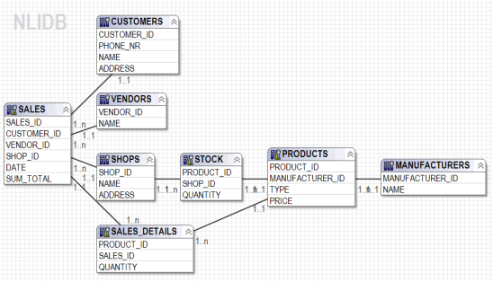

This agent allows the user to query structured data from a relational database using natural language by converting natural language questions to SQL queries (or other structured languages). Aside from relational databases, this extension (code name "Quest") supports multiple data sources, e.g. HIVE, Salesforce.com and others.

A semantic model of the database schema should be created during the training time. The model specifies the tables, columns, and their relations and is used by Quest to process the natural language questions and produce SQL queries. 

The Warehouse schema model that is shown here represents a Sales/Warehouse database with 8 tables. This schema is used with a sample Quest agent. To try this example, please load the yaml configuration [yaml configuration](./Quest.yaml) into your own sandbox environment. The sample questions bellow demonstrate what can be asked of this schema.

 

### Sample questions:  

* which  shops have stocked more  products than average quantity of stocked products; show shop name and location  
* which products have higher price than IPHONE; show product types  
* what is the name of manufacturer that has manufactured lower number of products than APPLE  
* what manufacturer manufactured more than 2 products; add manufacturer names  
* what products have prices greater than GALAXYTAB;  add product type and prices  
* what is the most expensive product; show product type  
* which vendor sold the most products in 2014; show vendor name  
* which shop has stocked the highest quantity of products; show shop name  
* what type of products are manufactured by SAMSUNG  
* how many times did Willie buy IPHONE  
* how many iphones were sold before October 2018 in shops located in New York  
* how many customers bought more than 5 IPHONEs before 2018  
* what are the types of products that were sold since 10/11/2011 in Chicago  
* which is the percentage of products with price above IPHONE  
* how many products with prices greater than 100 were sold before October 2017 in  New York or San Francisco  
* what is the name of customers who bought iphones more than 2 times.
